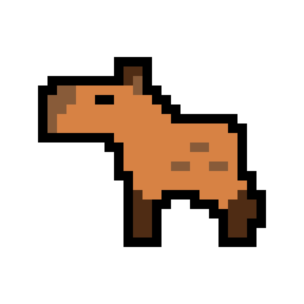

<div align="center">
  <a href="[https://github.com/othneildrew/Best-README-Template](https://github.com/Maxwell-SS/Capybara-Desktop-Pet.git)">
    
  </a>

  <h1 align="center">Capybara Desktop Pet</h1>

  <p align="center">
    A Capybara desktop companion
  </p>
</div>

## Showcase


## About
A simple pixel art capybara that runs around at the bottom of your screen, its not interactable and doesnt block mouse clicks. Its made with c++ some objective-c and uses opengl, glfw, glm and stb. 
### Note
This only works on Mac os

## Install
### Building
```sh
git clone https://github.com/Maxwell-SS/Capybara-Desktop-Pet.git
cd Capybara-Desktop-Pet
mkdir build
cd build
cmake ..
make
./Capybara
```
If you want to build your own .app then you can replace 
```sh
cmake ..
```
with 
```sh
cmake .. -DBUILD_BUNDLE=ON
```
This will generate a bundle folder with the .app inside of it

### Downloading dmg
1. Go to the releases and download the dmg
2. Open the dmg and drag the app to your Applications folder
   
If you try and run the app you will get an error saying that it is damaged, so you have to run these 3 commands to fix it
```sh
sudo spctl --master-disable
xattr -cr /Applications/Capybara.app
sudo spctl --master-enable
```

## Useage
Once you run the application you will see a new widget appear in the top right of your screen.
This is used to quit the capybara app and also toggle whether it apears on one desktop or all.

## Credit
Pixel Art: https://rainloaf.itch.io/capybara-sprite-sheet
